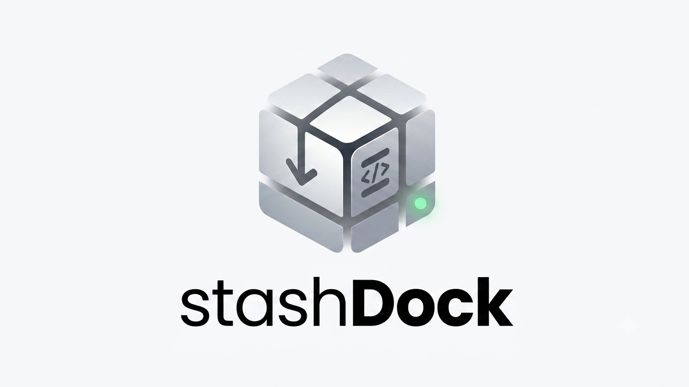

<h1 align="center">
  <br/>
  StashDock
</h1>

<p align="center">
  <strong>A self-hosted Git project manager built with Laravel.</strong><br/>
  Manage all your local Git repositories from a single, clean web dashboard.
</p>

<p align="center">
  
  
  
  
</p>

---

## ✨ Features

- 📁 **Project Scanner** — Auto-scans your project directory and lists all Git repositories.
- 🔄 **Quick Sync** — Stage, commit, and push all changes in one click.
- 🌿 **Branch Manager** — Switch between branches or create new ones without touching the terminal.
- 🔍 **Diff Viewer** — View colorized before/after code changes right in the browser.
- ⬇️ **Fetch & Pull** — Download remote changes without leaving the dashboard.
- 📦 **Stash Manager** — Save and restore work-in-progress changes easily.
- ⚠️ **Danger Zone** — Hard reset and clean operations with two-step confirmation to prevent accidents.
- 📊 **Activity Dashboard** — Visual commit history heatmap for all projects.
- ⚙️ **Settings** — Configure your GitHub Personal Access Token and project directory.

## 🛠️ Tech Stack

- **Backend:** PHP 8.2+, Laravel 12.x
- **Frontend:** Alpine.js, Tailwind CSS, Vite
- **Database:** SQLite (default) / MySQL
- **Auth:** Laravel Breeze (username-based login)

## 🚀 Installation

### Requirements
- PHP >= 8.2
- Composer
- Node.js & npm
- Git

### Steps

```bash
# 1. Clone the repository
git clone https://github.com/duckimp/StashDock.git
cd StashDock/stashdock

# 2. Install PHP dependencies
composer install

# 3. Install Node.js dependencies and build assets
npm install && npm run build

# 4. Copy environment file and generate app key
cp .env.example .env
php artisan key:generate

# 5. Run database migrations and seeders
php artisan migrate --seed

# 6. Start the development server
php artisan serve
```

Then open your browser and navigate to `http://127.0.0.1:8000`.

## ⚙️ Configuration

After login, go to the **Settings** page to configure:

1. **Parent Directory** — The absolute path to the folder containing all your projects (e.g. `/home/andi/Documents/PROJECT`).
2. **GitHub Personal Access Token (PAT)** — Required for push/sync operations. Generate one at [GitHub Settings → Tokens](https://github.com/settings/tokens) with `repo` scope.

## 📂 Project Structure

```
stashdock/
├── app/
│   ├── DTOs/           # ProjectDTO
│   ├── Http/Controllers/
│   ├── Models/
│   └── Services/       # GitService, ScannerService, SettingsService
├── resources/views/
│   ├── layouts/
│   ├── projects/
│   │   └── partials/   # Modals: sync, diff, branch, danger
│   ├── dashboard.blade.php
│   └── settings/
└── tests/
    └── Feature/
```

## 🤝 Contributing

Contributions are very welcome! Feel free to fork this repository, make improvements, and submit a pull request. Please make sure to:

- Keep the original copyright notice (`Copyright (c) 2025 Andi`) in any distributed copies, as required by the MIT License.
- Write tests for any new features if applicable.
- Follow the existing code style.

## 📄 License

This project is open-source software licensed under the [MIT License](LICENSE).

Copyright (c) 2025 **Andi** — You are free to use, modify, and distribute this software, as long as the original copyright notice is included.

---

<p align="center">Made with ❤️ by Andi</p>
